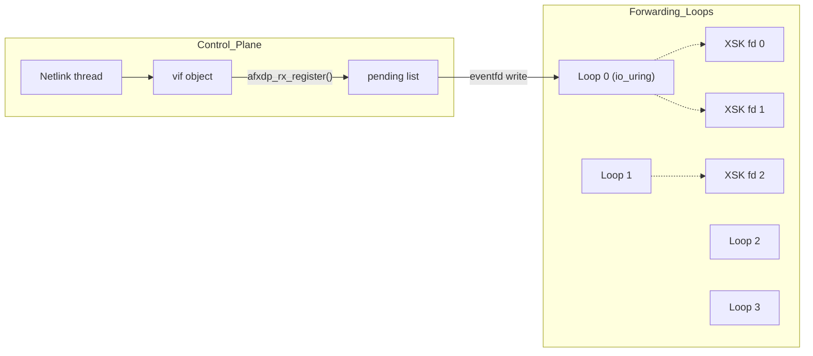

# AF_XDP vRouter – Datapath Architecture & Development Notes

> **Status:** Evolving Draft (Last Updated: 2025-06-23)
> **Next Major Goal:** Introduction of a consolidated forwarding thread model. -> done

---

## 1. Overview

This document captures the design discussions, issues, and current status of the AF_XDP-based datapath integration for vRouter. Key focus areas include:

* **Memory Management:** A custom memory pool (`bpool`) and cache (`bcache`) system for efficient buffer handling with UMEM.
* **AF_XDP Socket Integration:** Setup, configuration, and per-queue management of AF_XDP sockets.
* **Current RX/TX Path:** The current model utilizes dedicated threads per RX queue for packet processing.
* **Performance:** Initial validation using `iperf3` and system profiling tools.
* **Future Work:** Transitioning to a consolidated forwarding thread model to optimize resource utilization and scalability.

---

## 2. Memory Pool Architecture (`bpool` & `bcache`)

A shared memory pool (`bpool`) and per-processing-entity caches (`bcache`) are used for managing packet buffers with AF_XDP's UMEM.

* **`bpool` (Global UMEM Pool):**
    * Shared across all XSK sockets for a given UMEM region.
    * Manages slabs of packet buffers, logically partitioned into:
        * `slabs_full`: Slabs containing data-filled buffers, ready for consumption by the application/RX path.
        * `slabs_empty`: Slabs containing free buffers, available for producers (e.g., to be filled by hardware via XDP, or for TX).
    * Synchronization for accessing and swapping slabs between `bpool` and `bcaches` is managed by a single lock (currently using `pthread_mutex_t`, with spinlocks also under evaluation) within `bpool`.

* **`bcache` (Local Slab Cache):**
    * Associated with each processing entity (e.g., currently, each per-queue RX thread; in the future, each forwarding thread).
    * Holds a small number of slabs locally to minimize contention on the global `bpool` lock:
        * `slab_cons`: Slab from which the consumer (e.g., RX thread) reads packet data.
        * `slab_prod`: Slab to which the producer (e.g., an application preparing TX packets, or the RX path returning freed buffers to UMEM) writes/returns buffers.
    * Slab exchanges between `bcache` and `bpool` always occur for entire slabs at a time.

---

## 3. Current Datapath Model (Per-Queue RX Threads)

The current implementation utilizes a threading model where packet reception is handled by dedicated threads, with one thread assigned to each active XSK queue.

* **Interface and XSK Setup (`afxdp_veth_if_add`, `xsk_configure`):**
    * When a virtual interface (`vif`) is added, corresponding `vr_afxdp_ethdev` and `vr_afxdp_xsk_socket_info` structures are initialized for each of its hardware/receive queues.
    * This includes UMEM configuration (via the shared `bpool`) and XSK socket creation for each queue.

* **RX Threading (`afxdp_rx_thread_func`):**
    * A dedicated RX thread is spawned for each configured XSK queue.
    * This thread continuously polls its assigned XSK socket using `afxdp_recv`.
    * Received packets are passed to vRouter's generic receive function (`vif->vif_rx`).
    * CPU affinity is typically set per RX thread based on the interface or queue ID.

* **TX Path (`afxdp_tx_burst`):**
    * Packet transmission is handled by functions like `afxdp_tx_burst`, which are called from the context that decides to send a packet (e.g., after processing by `vif_rx` or from a forwarding decision).
    * TX completion and buffer recycling back to `bcache`/`bpool` are managed via `afxdp_tx_complete`.

* **Challenges of this model:**
    * A large number of interfaces/queues can lead to an excessive thread count, increasing context-switching overhead and resource consumption.
    * CPU cores may not be utilized optimally if some queues are idle while others are heavily loaded.

---

## 4. Baseline Performance (Per-Queue Thread Model, Single Queue, MTU 1500)

*This data reflects the performance of the current per-queue RX thread model.*

| Metric                      | Value                           |
| --------------------------- | ------------------------------- |
| `iperf3 -c <IP> -Z -t 10s`  | **4.7 Gb/s** (single TCP stream) |
| Retransmissions             | ~1 per 10s                      |
| CPU (RX thread `perf stat`) | ~100% of one core/vif; IPC ≈ 1.2     |

---

## 5. Next Steps: Consolidated Forwarding Thread Model (Design Phase)

To address the challenges of the per-queue thread model and improve scalability, the next major development goal is the introduction of a consolidated forwarding thread architecture.

* **Objective:**
    * Reduce the total number of packet processing threads to a small, configurable number (e.g., 3-4 forwarding threads).
    * Improve CPU core utilization and reduce context-switching overhead.

* **Proposed Approach (High-Level):**
    * Each forwarding thread will be responsible for managing I/O for multiple XSK sockets (queues).
    * I/O multiplexing (e.g., using `poll()` or `epoll()`) will be employed within each forwarding thread to monitor its assigned XSK sockets for activity.
    * Forwarding threads will be pinned to specific CPU cores for optimal cache performance and predictable latency.
    * Dynamic addition/removal of VIFs will require updating the set of FDs monitored by the forwarding threads.

* **Expected Benefits:**
    * Improved scalability with an increasing number of interfaces and queues.
    * More predictable performance characteristics.
    * Simplified CPU affinity management.

* **Key Design Considerations:**
    * Distribution of XSK queues among forwarding threads (load balancing).
    * Mechanism for forwarding threads to dynamically discover and manage new/removed XSK sockets.
    * Inter-thread communication if forwarding decisions require state from other threads or cores (to be minimized).

*(Further details, design choices, and implementation notes for the forwarding thread model will be added as development progresses.)*

---

## 6. Consolidated Forwarding Thread Model – io_uring Implementation (June 2025)

### 6.1 Overview of Changes

| Feature                    | Per-Queue Thread model           | v2: io\_uring Forwarding Loops                    |
| -------------------------- | --------------------------------- | ------------------------------------------------------------------- |
| Thread Count               | Scales with number of queues      | Fixed at **NUM\_FWD\_THREADS** (default: 4)                         |
| I/O Mechanism              | `poll()` with busy loop           | `IORING_OP_POLL_ADD` with `MULTI`                                   |
| Dynamic Queue Registration | Spawns a thread per queue         | Uses `eventfd` to wake up forwarding loop                           |
| CPU Usage (64 queues)      | 64 threads                        | **4 threads**                                                       |
| I/O CQ Handling            | Direct per-thread `poll()` loop   | Centralized `io_uring_submit_and_wait()` loop with per-CQE dispatch |

### 6.2 Why I moved to *io_uring* instead of pure busy polling method

* **Fewer syscalls**  
  Using *io_uring* we issue a single `io_uring_enter()` and harvest
  many CQEs at once, drastically cutting user/kernel crossings.

* **Fewer context switches**  
  Busy-polling spins one thread per queue, so the scheduler switches
  hundreds of times per second as queue count grows.  
  A fixed set of (for example) four *io_uring* loops keeps the switch
  rate bounded and avoids IRQ contention.

* **Lower kernel overhead**  
  `poll()` must walk a list of fds on every call.  
  With *io_uring* the kernel simply writes CQEs into the shared ring;
  no poll-list traversal is needed.

* **Scales cleanly**  
  Fixed thread counts make CPU pinning and capacity planning straightforward.

### 6.2 Diagram

- XSK registration: When a VIF is added, afxdp_rx_register() assigns the XSK to a forwarding thread with the fewest active queues.
- Thread wake-up: The registration also writes to the corresponding eventfd.
- Pending queue: The forwarding thread consumes newly registered queues from a pending list protected by a mutex.
- I/O Handling: All XSK FDs are registered via IORING_OP_POLL_ADD with MULTI, so no re-submission is required unless IORING_CQE_F_MORE is missing.

## 7. Updated Performance (veth, MTU 1500)

| Metric                     | Per-Queue Thread Model | io\_uring Forwarding Loops |
| -------------------------- | ---------------------- | -------------------------- |
| `iperf3 -c <IP> -Z -t 10s` | **4.7 Gb/s**           | **6–7 Gb/s**           |
| CPU Usage                  | \~100% per thread      | \~65% across 4 threads     |

